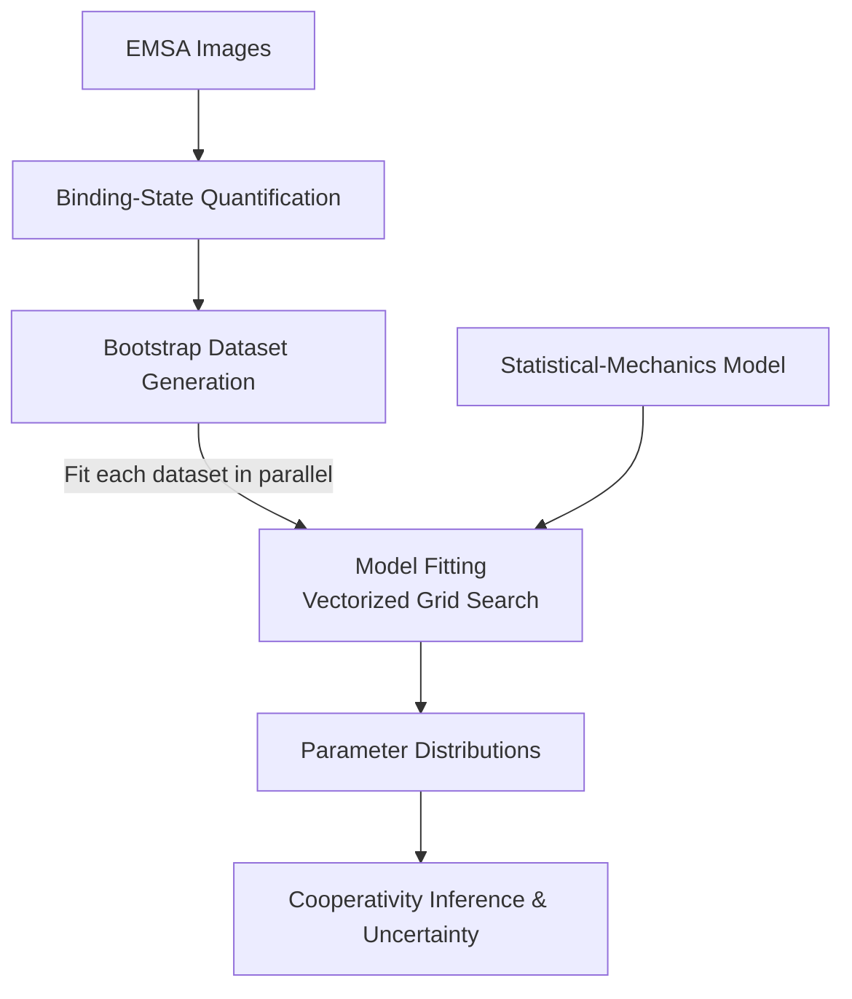
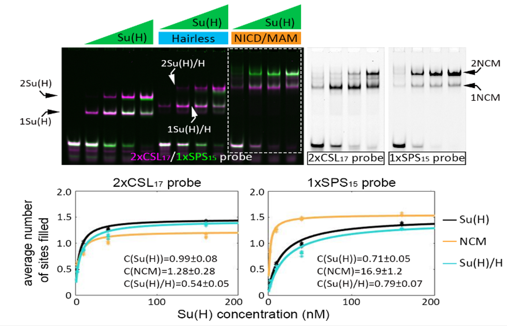

# multi-model-cooperativity-inference
### Vectorized grid-search fitting of a statistical-mechanics model, with parallel parametric bootstrap for parameter uncertainty estimation..

## Table of Contents

- [Overview](#overview)
- [Goal](#goal)
- [Scientific Context](#scientific-context)
- [Computational Pipeline](#computational-pipeline)
- [Statistical-Mechanics Modeling](#statistical-mechanics-modeling)
- [Joint Multi-State Fitting](#joint-multi-state-fitting)
- [Vectorized Grid Search](#vectorized-grid-search)
- [Statistical Validation & Uncertainty](#statistical-validation--uncertainty)
- [Results](#results)
- [Key Findings](#key-findings)
- [Repository Structure](#repository-structure)


---

## Overview

This project develops a quantitative framework for inferring **cooperative protein–DNA binding from Electrophoretic Mobility Shift Assay (EMSA) data**. Experimental band intensities are converted into binding-state measurements and fitted using a **mathematical model based on statistical mechanics**, described by three equations relating the observed binding states to the underlying binding parameters.

To fit the model parameters, I implemented a **vectorized grid-search approach** that evaluates parameter combinations within specified ranges. The resulting fit is used to quantify binding cooperativity and evaluate the uncertainty of the inferred parameters through parallel statistical resampling (**bootstrap**).

## Goal

The goal of this project is to **extract a quantitative measure of binding cooperativity from EMSA data** by fitting the experimental measurements to a statistical-mechanics model.

The analysis is designed to infer the cooperativity coefficient and associated model parameters, together with their statistical uncertainty.

## Scientific Context

The **Notch signaling pathway** plays a central role in both development and disease. Notch target-gene expression is mediated by the DNA-binding factor CSL, called Su(H) in *Drosophila*. Some Notch-responsive enhancers contain two adjacent CSL binding sites in a head-to-head architecture, known as **Sequence-Paired Sites (SPSs)**, which play a crucial role in Notch-dependent gene regulation. Activating complexes containing Notch and Su(H) are known to bind cooperatively at SPS sites, while less is known about the binding behavior of repressive states involving Su(H), the co-repressor Hairless (H), or Su(H) alone. Quantitatively characterizing this cooperativity could help unravel the strong context dependence of Notch signaling and improve its predictive power, advancing our understanding of Notch-related developmental processes and diseases.

In **Electrophoretic Mobility Shift Assays (EMSA)**, purified proteins are incubated with fluorescently labeled DNA probes. Here, the probes contain either paired CSL binding sites in a head-to-tail orientation or SPS sites in a head-to-head orientation, while the proteins examined include Notch (N), Su(H), and Hairless (H). When the protein–DNA mixtures are separated by gel electrophoresis, doubly bound probes migrate more slowly than singly bound or unbound probes, allowing separation of the **0-, 1-, and 2-occupied states**. Because the relative populations of these states depend on both binding affinity and cooperativity, a mathematical model is required to separate these effects and quantitatively infer the **cooperativity coefficient**.

## Computational Pipeline



## Statistical-Mechanics Modeling

To quantitatively relate the EMSA results images to the underlying molecular interactions, the data were described using a **two-site equilibrium binding model**. The model predicts the probability of observing a DNA probe with **zero, one, or two bound  complexes** as a function of protein concentration, binding affinity, and cooperativity.

The statistical weight of binding to a single site is defined as:

$$
\alpha = \frac{[TF]}{K_d}
$$

where $[TF]$ is the transcription-factor complex concentration and $K_d$ is the dissociation constant for binding to a single site.

For a probe containing two available binding sites, the probabilities of the three occupancy states are:

$$
P_0 = \frac{1}{1 + 2\alpha + C\alpha^2}
$$

$$
P_1 = \frac{2\alpha}{1 + 2\alpha + C\alpha^2}
$$

$$
P_2 = \frac{C\alpha^2}{1 + 2\alpha + C\alpha^2}
$$

where $P_0$, $P_1$, and $P_2$ represent the probabilities of observing **0, 1, or 2 bound complexes**, respectively.

The **cooperativity coefficient $C$** modifies the affinity of the second binding event:

$$
K_{d2} = \frac{K_d}{C}
$$

Therefore:

- $C = 1$ — independent, non-cooperative binding
- $C > 1$ — positive cooperativity
- $C < 1$ — negative cooperativity

### Accounting for Unavailable Binding Sites

We observed that even at high concentrations of Su(H) the 1-site state does not decay to zero  (e.g. see NCM on SPS), as well as the signal of the 0-site state. We therefore assumed that there is a probability, $f$, that a site will become unavailable for binding.  To account for this, the model includes an additional parameter, $f$, representing the probability that an individual binding site is unavailable.

For a probe containing two sites, the probabilities of having two, one, or zero available binding sites are:

$$
P(\text{2 available}) = (1-f)^2
$$

$$
P(\text{1 available}) = 2f(1-f)
$$

$$
P(\text{0 available}) = f^2
$$

Combining these possibilities with the equilibrium binding model gives the experimentally observable occupancy probabilities:

$$
P_2 =
(1-f)^2
\frac{C\alpha^2}
{1+2\alpha+C\alpha^2}
$$

$$
P_1 =
(1-f)^2
\frac{2\alpha}
{1+2\alpha+C\alpha^2}
+
2f(1-f)
\frac{\alpha}{1+\alpha}
$$

$$
P_0 =
(1-f)^2
\frac{1}
{1+2\alpha+C\alpha^2}
+
2f(1-f)
\frac{1}{1+\alpha}
+
f^2
$$

The model therefore contains three parameters inferred from the experimental data:

| Parameter | Meaning |
|---|---|
| $K_d$ | Dissociation constant for binding to a single site |
| $C$ | Cooperativity coefficient describing the second binding event |
| $f$ | Probability that an individual binding site is unavailable |

These equations provide the mathematical link between the experimentally measured EMSA occupancy states and the underlying binding affinity and cooperativity.

## Joint Multi-State Fitting

For each experimental condition, the measured **0-, 1-, and 2-occupied states** were fitted simultaneously across the tested protein concentrations. Rather than fitting each occupancy curve independently, a single set of parameters — $K_d$, $C$, and $f$ — was used to generate predictions for all three states.

The fitting procedure searches for the parameter combination that minimizes the **combined least-squares loss function** between the experimental measurements and the three corresponding model predictions:

$$
P_0([TF]), \qquad P_1([TF]), \qquad P_2([TF])
$$

This joint fitting constrains the parameter estimates because a candidate parameter set must explain the complete distribution of binding states across all measured concentrations, rather than fitting only one curve.

The procedure was applied separately to each experimental condition, including different **DNA probe architectures** (CSL and SPS) and **regulatory complex types** (activating and repressing). This allowed the inferred cooperativity coefficient $C$ to be quantitatively compared between conditions while using the same underlying mathematical framework.

## Vectorized Grid Search

To identify the parameter vector that best fits each bootstrap-generated dataset, I implemented a **vectorized grid-search algorithm** over the parameter ranges of $K_d$, $C$, and $f$. The fitting procedure is repeated independently across the bootstrap datasets **in parallel**.

The candidate parameter values are stored in vectors. Instead of inserting one parameter combination into the model at a time and obtaining individual predictions, these vectors are arranged along different array dimensions and inserted into the model together.

For example, multiplying a column vector of protein concentrations by a row vector of inverse $K_d$ values produces a **matrix of $\alpha$ values**, with one entry for every concentration–$K_d$ combination. Element-wise operations (`.*`, `./`, and `.^`) then combine these values with the candidate $C$ and $f$ values to calculate predictions across the full parameter grid.

This uses MATLAB’s **optimized array operations** to evaluate many parameter combinations together, replacing nested loops that calculate each combination separately. Summing the squared prediction errors across measurements and occupancy states produces a **three-dimensional matrix of losses**, whose lowest element identifies the best-fitting combination of $K_d$, $C$, and $f$.

The squared differences between the predictions and the data are summed across the measured concentrations and occupancy states, producing a **three-dimensional matrix of joint least-squares losses**. Its dimensions correspond to the candidate values of $K_d$, $C$, and $f$, and each element contains the loss for one parameter combination. The indices of the element with the lowest loss identify the best-fitting parameter vector.

The search follows a **semi-automatic, iterative process**. Parameter ranges and grid spacing are specified for each experimental condition, and the bootstrap fitting produces distributions of the inferred parameters. After each iteration, these distributions are closely inspected using histograms. If fitted values accumulate at a boundary or show unexpected patterns, the search ranges and grid spacing are reviewed, adjusted as needed, and the fitting procedure is repeated.

Earlier versions automatically refined the grid around the best-fitting regions. The current approach combines **automated vectorized fitting with manual inspection of the bootstrap parameter distributions**. Evaluating all combinations within the specified grid and reviewing the results between iterations helps reduce the risk of narrowing the search around a misleading local minimum caused by coarse sampling or restrictive parameter ranges. Histogram inspection can flag potential problems, while repeating the search with broader ranges or finer spacing helps assess whether the inferred parameters remain stable.

The fitting process therefore follows:

**Parameter vectors defining the search grid → Parallel bootstrap fitting using vectorized array operations → Parameter distributions → Histogram inspection → Range or spacing adjustment and repeat if needed**

## Statistical Validation & Uncertainty

To quantify the uncertainty of the inferred parameters, I used a **bootstrap-based resampling approach**. For each experimental condition, **1,000 synthetic datasets** were generated using the experimentally measured mean and standard deviation.

The complete fitting procedure was then repeated independently for each generated dataset, producing distributions of the fitted parameters:

$$
K_d,\qquad C,\qquad f
$$

This propagates the experimental variability through the full model-fitting pipeline rather than estimating uncertainty only from the final best-fit solution.

The resulting parameter distributions were used to calculate **95% confidence intervals**, providing a measure of the robustness and uncertainty of the inferred binding affinity and cooperativity.

## Results

The joint fitting framework reproduced the experimentally measured **0-, 1-, and 2-occupied states** across the tested protein concentrations and enabled quantitative inference of the binding parameters.



*Figure 1. EMSA measurements and corresponding model fits for CSL and SPS probes. Adapted from Fig. 1D–E of Kuang et al. (2021), PLOS Genetics.*

The inferred cooperativity coefficients revealed a strong dependence on both **DNA architecture** and **regulatory complex type**. The **Notch co-activator complex (NCM)** displayed strong positive cooperativity on SPS sites, with an inferred cooperativity coefficient of:

$$
C = 16.9 \pm 1.2
$$

In contrast, NCM binding to the non-cooperative CSL architecture showed little cooperativity. **Su(H) alone** and the **Su(H)/Hairless repressing complex** also showed little or no positive cooperativity on either architecture.

These results demonstrate that the modeling framework can distinguish **binding affinity from binding cooperativity** and quantitatively compare cooperative behavior across DNA architectures and regulatory complexes.

[Kuang et al., 2021 — *Enhancers with cooperative Notch binding sites are more resistant to regulation by the Hairless co-repressor*](https://doi.org/10.1371/journal.pgen.1009039)

## Key Findings

- The modeling framework enabled **binding affinity and cooperativity to be inferred separately** from the same EMSA occupancy data.
- The Notch **co-activator complex (CoA)** showed strong cooperative binding on SPS DNA, with an inferred cooperativity coefficient of approximately **$C = 16.9$**.
- This strong cooperativity was **specific to the SPS architecture** and was not observed to the same extent on the non-cooperative CSL configuration.
- The **Su(H)/Hairless co-repressor complex (CoR)** and Su(H) alone did not display the strong SPS-dependent cooperativity observed for the activating complex.
- Together, the results show that DNA-site architecture can selectively alter the cooperative behavior of different regulatory complexes, providing a quantitative explanation for context-dependent Notch regulation.

## Repository Structure

```text
multi-model-cooperativity-inference/
├── README.md
├── src/
│   ├── EMSA_Fit.m
│   └── figure_builder.m
└── figures/
    └── fig_1.png
```

- **`src/EMSA_Fit.m`** — Experimental occupancy data, vectorized grid-search fitting, parallel bootstrap, and parameter-distribution histograms.
- **`src/figure_builder.m`** — Plots experimental occupancy measurements alongside model predictions.
- **`figures/fig_1.png`** — EMSA measurements and model fits displayed in the Results section.
- **`README.md`** — Scientific background, mathematical model, computational workflow, and results.

